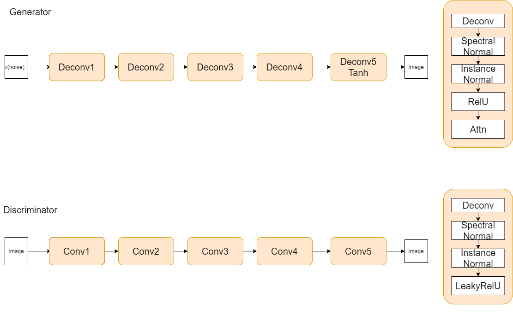

# Full Self-Attention GAN with different Loss Function
## Overview
This repository contains an Pytorch implementation of WGAN, WGAN-GP, WGAN-DIV and original GAN loss function.
With full coments and my code style.

## About WGAN

## Dataset 
- MNIST
`python3 main.py --dataset mnist --channels 1`
- FashionMNIST
`python3 main.py --dataset fashion --channels 1`
- Cifar10
`python3 main.py --dataset cifar10 --channels 3`

## Implement
``` python

```
## Usage
- MNSIT
`python3 main.py --dataset mnist --channels 1 --version [version] --batch_size [] --adv_loss [] >logs/[log_path]`
- FashionMNIST
`python3 main.py --dataset fashion --channels 1 --version [version] --batch_size [] --adv_loss [] >logs/[log_path]`
- Cifar10
`python3 main.py --dataset cifar10 --channels 3 -version [version] --batch_size [] --adv_loss [] >logs/[log_path]`

## FID
FID is a measure of similarity between two datasets of images. It was shown to correlate well with human judgement of visual quality and is most often used to evaluate the quality of samples of Generative Adversarial Networks. FID is calculated by computing the Fréchet distance between two Gaussians fitted to feature representations of the Inception network.

For the FID, I use the pytorch implement of this repository. [FID score for PyTorch](https://github.com/mseitzer/pytorch-fid)

| Method | MNIST | cifar10 |
| ---- | ---- | ---- |
| attnG_wgandiv | 97.7207 | null | 
| attnG_wgandiv_nobatch | NULL | NULL |
| fullattn_wgangp_ori | 110.4787 | null | 
| attnG_SND_wgandiv | null | null |
| attnG_wgandiv_nosn | null | null |

## Reference
1. [WGAN](https://arxiv.org/abs/1701.07875)